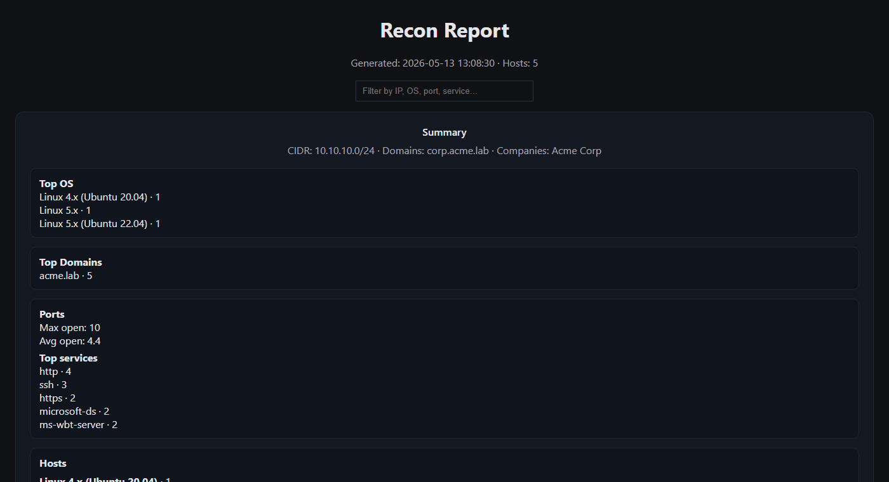
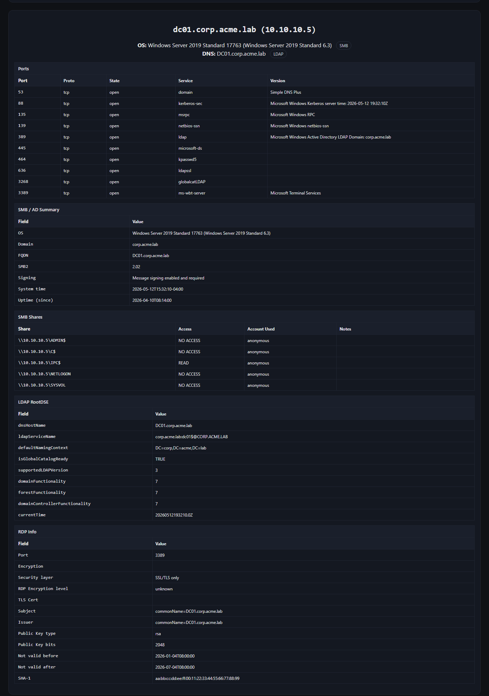
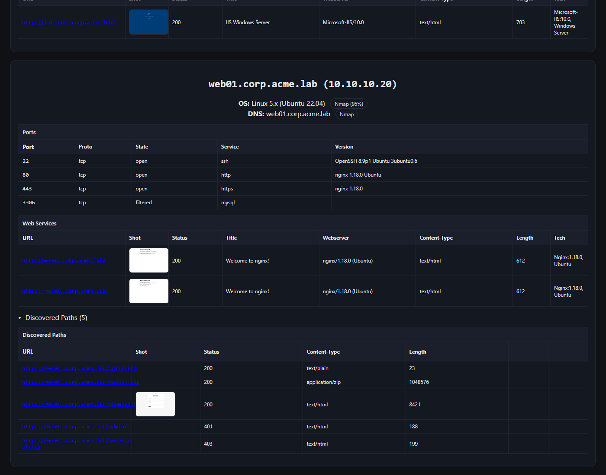
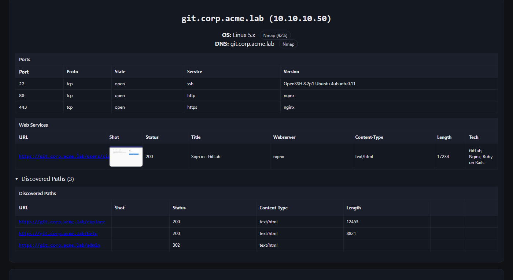

# Sonar

Recon pipeline. Runs theHarvester, nmap, httpx-toolkit, katana, feroxbuster,
and headless chromium against a CIDR / domain / ASN / company name and
produces an HTML report.



## What it does

Per-host report with open ports, service banners, OS fingerprints,
AD/SMB/LDAP/RDP enumeration, web service metadata, content discovery
results, and screenshots of every discovered URL. Output is a single
dark-mode HTML page with a filter input, a host index grouped by OS, and
inline thumbnails of the screenshots.

Raw tool output (XML / JSONL / stderr) gets saved under
`output/<run_timestamp>/raw/<tool>/`.

## Pipeline stages

| Stage          | Wrapper               | Output                                                      |
|----------------|-----------------------|-------------------------------------------------------------|
| OSINT          | `harvester_wrap.py`   | subdomains + IPs from public sources                        |
| Scope filter   | `scope_utils.py`      | drops blacklisted domains, IPs, CIDRs, regex matches        |
| Port / service | `nmap_wrap.py`        | `-sS -sV -O --top-ports 1000` plus AD NSE scripts           |
| Web probing    | `httpx_wrap.py`       | title, status, server, tech, redirect chain                 |
| Crawling       | `katana_wrap.py`      | depth-2 JS-aware crawl with linkfinder                      |
| Content disc.  | `ferox_wrap.py`       | directory brute force, one canonical base per IP            |
| Screenshots    | `screenshot_wrap.py`  | headless chromium PNG for each discovered URL               |
| Reporting      | `reporting/render.py` | Jinja2 HTML report                                          |

nmap is run with an NSE bundle so AD info comes back without a second scan:

```
default,
smb-enum-shares, smb-os-discovery, smb2-security-mode, smb2-time,
ldap-rootdse,
rdp-ntlm-info, rdp-enum-encryption, ssl-cert
```

Hostnames found by theHarvester get de-duped against IPs already in scope
and re-attached as aliases on the matching nmap host, so a domain and the
IP it resolves to don't get scanned twice.

## What the report looks like

### Top of the report

Header has the scope, host count, and a filter input that hides cards as
you type (matches against IP, OS, port, service, title, tech). Summary card
groups hosts by OS:


### AD / domain controller host card

Per-host card has the nmap port table plus parsed SMB, LDAP RootDSE, and
RDP / NTLM info pulled out of the NSE script output. OS and DNS are taken
from whichever source has the most detail (SMB > RDP > nmap fingerprint;
LDAP dnsHostName > SMB FQDN > RDP DNS > rDNS):



### Web host with screenshots and discovered paths

Web Services lists every URL httpx reached (including via redirect chains)
with a thumbnail. Discovered Paths includes everything katana and
feroxbuster turned up, deduped and sorted with 200s first:





## Requirements

System tools (Kali / Debian):

- nmap, httpx-toolkit, katana, feroxbuster, theHarvester
- chromium (also accepts chromium-browser, google-chrome,
  google-chrome-stable)

Python 3.11+ with Jinja2 and MarkupSafe (see `requirements.txt`).

Optional: Go toolchain if you install katana from source. Set `KATANA_BIN`
if it lives outside `$PATH`.

## Install (Kali)

```bash
sudo apt update
sudo apt install -y nmap httpx-toolkit feroxbuster theharvester \
                    chromium python3 python3-venv
```

Katana via Go (skip if your distro packages it):

```bash
sudo apt install -y golang
go install github.com/projectdiscovery/katana/cmd/katana@latest
export PATH="$PATH:$(go env GOPATH)/bin"
```

Python deps:

```bash
python3 -m venv env
source env/bin/activate
pip install -r requirements.txt
```

## Usage

```bash
# single CIDR
python3 main.py --cidr 192.168.56.0/24

# domain (passive OSINT + active probing of resolved hosts)
python3 main.py --domain example.com

# multiple targets, verbose, skip ferox
python3 main.py -v --skip-ferox \
                --cidr 10.10.10.0/24 \
                --domain corp.example.com \
                --domain dev.example.com

# targets from files (one per line, # for comments)
python3 main.py --domain-file domains.txt --cidr-file cidrs.txt

# custom config path
python3 main.py --config myconfig.json --domain example.com
```

Targets can be mixed. The pipeline:

1. runs theHarvester for every `--domain` and `--company`
2. merges harvested hosts/IPs with `--cidr` / `--domain` / `--asn` inputs
3. applies the scope blacklist
4. nmaps the union
5. probes any host with HTTP-ish ports (80, 443, 8000, 8080, 8443, or a
   banner of http/https) and enriches with katana/ferox
6. screenshots up to 20 discovered URLs per host (root URLs always
   included, even on non-200 responses)
7. renders the report

Output layout:

```
output/20260513T130830Z/
├── report.html
├── screens/
│   └── <sha256-prefix>.png
└── raw/
    ├── nmap/      nmap_*.xml + .meta.json
    ├── httpx/     httpx_*.jsonl + .meta.json
    ├── katana/    katana_*.jsonl + .meta.json
    ├── ferox/     ferox_*.jsonl + .meta.json
    └── theharvester/  *.json + *.xml
```

## Config

`main.py` reads `config.json` from the working directory by default; pass
`--config <path>` to override. Same JSON holds extra tool flags and the
scope blacklist:

```json
{
  "tools": {
    "nmap":         { "extra_args": ["-T3"] },
    "httpx":        { "extra_args": ["-rl", "100"] },
    "katana":       { "extra_args": ["-jc", "-d", "3"] },
    "ferox":        { "extra_args": ["-w", "/usr/share/wordlists/dirb/common.txt"] },
    "theharvester": { "extra_args": ["-b", "crtsh,bing,duckduckgo"] }
  },
  "scope_blacklist": {
    "domains": ["acme-prod.com", "support.acme.com"],
    "ips":     ["10.10.10.99"],
    "cidrs":   ["10.0.0.0/8"],
    "regex":   ["\\.internal$"]
  }
}
```

Blacklist entries are checked at every stage: harvester results, nmap
target set, httpx targets, katana seeds, ferox bases. Domain entries match
the host and any subdomain (`acme.com` blocks `www.acme.com`). CIDR entries
match IPs inside the network. Regex entries match either the hostname or
the full URL.

## Notes

nmap runs with `-Pn -O -sS`, which needs root. Use sudo, or give the binary
`cap_net_raw,cap_net_admin+eip`.

Screenshots are cached by SHA-256 of the URL, so re-running the same URL
won't relaunch chromium.

`httpx_wrap.py` looks for the binary as `httpx-toolkit` (Kali's package
name). The ProjectDiscovery httpx binary is not the same tool as the Python
httpx library.

`katana_wrap.py` falls back to plain-URL parsing when katana doesn't emit
JSONL (older builds, certain crawl modes).

The merge in `recon_pipeline.py` collapses domain-to-IP duplicates and
unions ports/host-scripts, so re-scanning the same IP via different aliases
produces one host card, not several.
